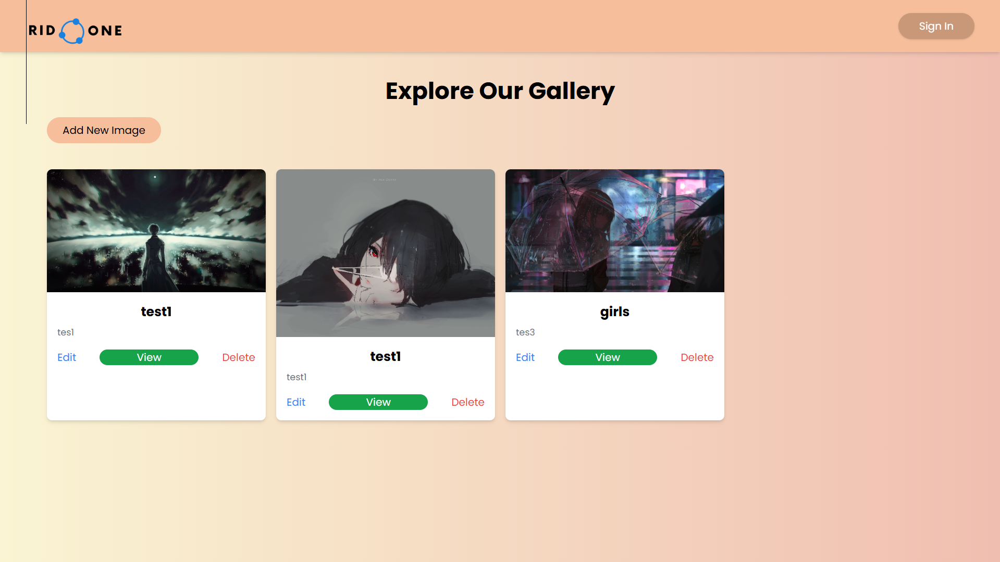

# 📌 CRUD Image with Laravel & React

Proyek fullstack sederhana untuk melakukan **CRUD gambar** menggunakan **Laravel 11** sebagai Backend API, **React JS** sebagai Frontend, dan **MySQL** sebagai database. Mendukung upload gambar, edit gambar, dan hapus gambar dengan tampilan UI yang clean dan modern.

---

## 📸 Preview

### Landing Page


### Halaman Utama



---

## ✨ Features

- 📤 Upload gambar
- ✏️ Edit gambar
- 🗑 Remove / delete gambar
- 🗄 Simpan gambar ke database
- 🔧 REST API Laravel
- ⚡ React frontend with Axios

---

## 🚀 Cara Menjalankan Project di Lokal

### 1. Clone Repository

```bash
git clone https://github.com/oneraid/CRUD-image-laravelreact.git
cd CRUD-image-laravelreact
```

---

### 2. Setup Backend (Laravel)

#### Masuk ke folder backend:

```bash
cd Laravel
```

#### Install dependencies:

```bash
composer install
```

#### Copy file environment:

```bash
cp .env.example .env
```

Atau rename manual: `.env.example` → `.env`

#### Konfigurasi Database

Edit file `.env`:

```env
DB_DATABASE=your_database
DB_USERNAME=your_username
DB_PASSWORD=your_password
```

#### Generate key:

```bash
php artisan key:generate
```

#### Migrasi tabel:

```bash
php artisan migrate
```

#### Jalankan server backend:

```bash
php artisan serve
```

Backend berjalan di: `http://localhost:8000`

---

### ⚠️ Penting: Atur Batas Upload di php.ini

Agar upload gambar tidak dibatasi hanya 2MB seperti default PHP, edit file `php.ini`:

```ini
upload_max_filesize = 100M
post_max_size = 100M
```

**Setelah perubahan → Restart Apache/Laragon/XAMPP.**

---

### 3. Setup Frontend (React)

#### Masuk ke folder frontend:

```bash
cd react
```

#### Install dependency:

```bash
npm install
```

#### Jalankan aplikasi:

```bash
npm start
```

Frontend berjalan di: `http://localhost:3000`

---

## 📂 Struktur Folder

```
CRUD-image-laravelreact/
│
├── Laravel/         # Backend API (Laravel 11)
│   ├── app/
│   ├── routes/
│   ├── database/
│   └── ...
│
└── react/           # Frontend React
    ├── src/
    ├── public/
    └── ...
```

---

## 🧰 Tools & Teknologi

- Laravel 11
- React JS
- Axios
- MySQL / MariaDB
- PHP 8+
- Composer
- Node.js + NPM

---

## 📜 License

Project ini open-source. Silakan digunakan untuk belajar atau pengembangan.

---

## 👤 Author

**Ridhwan Firdaus**  
GitHub: [https://github.com/oneraid](https://github.com/oneraid)
